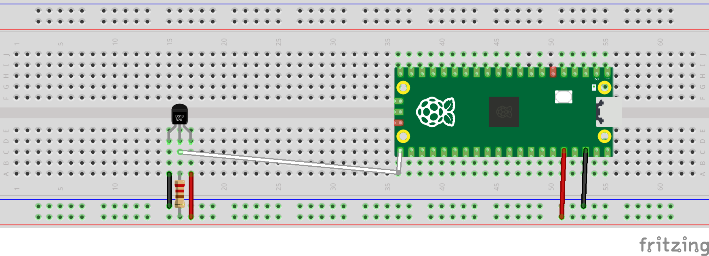
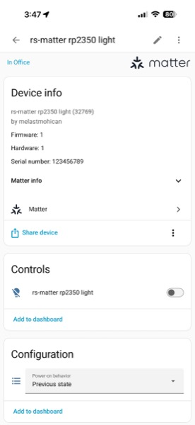
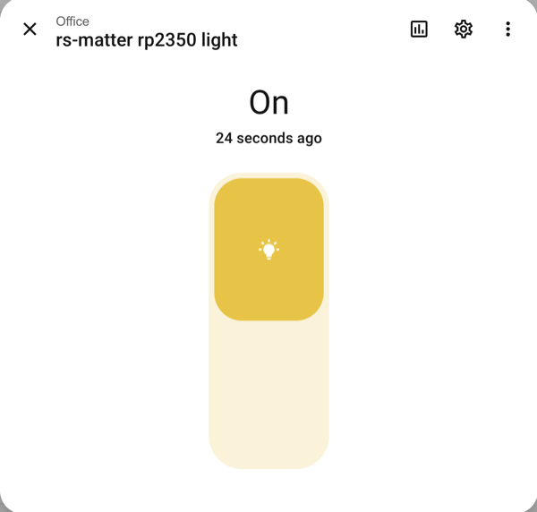
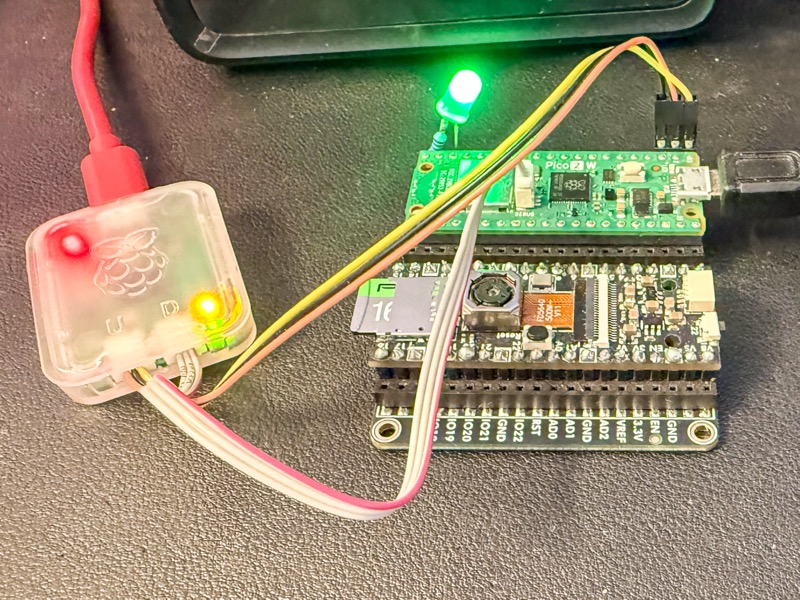

# Rust Embassy Examples for Raspberry Pi Pico 2

This repository contains examples for the Raspberry Pi Pico 2 (RP2350) board, written in Rust using the [Embassy](https://embassy.dev/) async framework.

## Project generated

```shell
cargo generate --git https://github.com/ImplFerris/pico2-template.git --name rust-rpico2-embassy-examples
```

## Hardware

**Board:** Raspberry Pi Pico 2

- **MCU:** RP2350 (Dual-core Arm Cortex-M33 and RISC-V cores)
- **On-board peripherals:**
  - LED on GPIO25

### Pinout


### Common Pin Assignments

- **I2C pins:**
  - **I2C0 SDA:** GPIO4
  - **I2C0 SCL:** GPIO5
  - **I2C1 SDA:** GPIO2
  - **I2C1 SCL:** GPIO3
- **UART pins:**
  - **UART0 TX:** GPIO0, **UART0 RX:** GPIO1
  - **UART1 TX:** GPIO8, **UART1 RX:** GPIO9

## Examples

### I2C Examples

#### hs3003_i2c

Reads temperature and humidity from an HS3003 sensor using the Embassy async framework.

```bash
cargo run --example hs3003_i2c
```

**Wiring (Arduino Modulino Thermo):**

```
     Modulino -> RPi Pico 2
----------    --------------
GND (black) -> GND
VCC (red)   -> 3.3V
SCL (yellow)-> GPIO5 (Pin 7) (I2C0 SCL)
SDA (blue)  -> GPIO4 (Pin 6) (I2C0 SDA)
```

**About HS3003:**

The Renesas HS3003 is a high-performance temperature and humidity sensor:
- Temperature range: -40°C to +125°C (±0.2°C accuracy)
- Humidity range: 0% to 100% RH (±1.5% accuracy)
- 14-bit resolution for both measurements
- Ultra-low power consumption

#### adxl345_i2c

Reads accelerometer data from an ADXL345 sensor over I2C0 using Embassy.

```bash
cargo run --example adxl345_i2c
```

**Wiring:**

```
     ADXL345 -> RPi Pico 2
----------    --------------
GND (black) -> GND
VCC (red)   -> 3.3V
SCL (yellow)-> GPIO5 (Pin 7) (I2C0 SCL)
SDA (blue)  -> GPIO4 (Pin 6) (I2C0 SDA)
```

**About ADXL345:**

The ADXL345 is a small, thin, low power, 3-axis accelerometer with high resolution (13-bit) measurement at up to ±16 g. Digital output data is formatted as 16-bit twos complement and is accessible through either an SPI (3- or 4-wire) or I2C digital interface.

### SPI Display Examples

#### zermatt

Displays a 320x240 image of Zermatt on the Adafruit 2.2" TFT LCD display in landscape mode.

```bash
cargo run --example zermatt
```

**Wiring (Eye-SPI Breakout):**

```
     Raspberry Pi Pico 2              Eye-SPI Breakout
   +-----------------------+      +---------------------------+
   |                       |      |                           |
   |  3V3 (Pin 36) --------+------+-> VIN   (Red Wire)        |
   |  GND (Pin 38) --------+------+-> GND   (Black Wire)      |
   |  GPIO18 (Pin 24) -----+------+-> SCK   (Blue Wire)       |
   |  GPIO19 (Pin 25) -----+------+-> MOSI  (Green Wire)      |
   |  GPIO16 (Pin 21) -----+------+-> MISO  (Yellow Wire)     |
   |  GPIO20 (Pin 26) -----+------+-> DC    (White Wire)      |
   |  GPIO21 (Pin 27) -----+------+-> RST   (Orange Wire)     |
   |  GPIO17 (Pin 22) -----+------+-> TCS   (Blue Wire)       |
   |                       |      |                           |
   +-----------------------+      +---------------------------+
```

#### zermatt_snow

Displays a 320x240 image of Zermatt on the Adafruit 2.2" TFT LCD display with animated falling snow, utilizing a physics engine and the Embassy async framework to draw to an off-screen `lcd-async` framebuffer and dispatch via DMA without blocking the CPU.

```bash
cargo run --example zermatt_snow
```

Wiring is identical to the `zermatt` example.

#### Waveshare 0.96" ST7735S Display Examples

The workspace includes examples for the Waveshare 0.96" 80x160 ST7735S LCD module built with both the **`display-driver`** async framework (`st7735_dd_*`) and the **`mipidsi`** driver crate (`st7735_mipi_*`).

**Common Wiring for Waveshare 0.96" ST7735S LCD:**

```text
     Raspberry Pi Pico 2          Waveshare 0.96" ST7735S LCD
   +-----------------------+      +---------------------------+
   |                       |      |                           |
   |  3V3 (Pin 36) --------+------+-> VCC                     |
   |  GND (Pin 38) --------+------+-> GND                     |
   |  GPIO17 (Pin 22) -----+------+-> CS                      |
   |  GPIO21 (Pin 27) -----+------+-> RST                     |
   |  GPIO20 (Pin 26) -----+------+-> DC                      |
   |  GPIO19 (Pin 25) -----+------+-> DIN(MOSI)               |
   |  GPIO18 (Pin 24) -----+------+-> CLK(SCK)                |
   |  GPIO14 (Pin 19) -----+------+-> BL (Backlight)          |
   |                       |      |                           |
   +-----------------------+      +---------------------------+
```

##### st7735_dd_ferris

Draws the Ferris mascot and Rust logo BMP images on the 80x160 ST7735S display using the async `display-driver` crate stack (`display-driver`, `display-driver-spi`, `display-driver-st7735`).

```bash
cargo run --example st7735_dd_ferris
```

##### st7735_dd_animation

Runs a smooth 30 FPS geometric pattern animation (rotating circles, pulsating center ring, and expanding corner accents) rendered into a 160x80 framebuffer and flushed asynchronously via `display-driver`.

```bash
cargo run --example st7735_dd_animation
```

##### st7735_mipi_ferris

Draws the Ferris mascot and Rust logo BMP images using the `mipidsi` display driver crate and `display-interface-spi`.

```bash
cargo run --example st7735_mipi_ferris
```

##### st7735_mipi_text

Draws text header banners, a separator line, colored geometric shapes, and bottom text labels using `mipidsi` and `display-interface-spi`.

```bash
cargo run --example st7735_mipi_text
```

### 1-Wire Examples

#### ds18b20

Reads temperature from a DS18B20 waterproof temperature sensor probe over a 1-Wire bus using Embassy. It utilizes a custom, cycle-accurate `PreciseDelay` implementation to achieve jitter-free sub-microsecond timing required by the 1-Wire protocol on the RP2350's Cortex-M33 core.

```bash
cargo run --example ds18b20
```

**Wiring Schematic:**

```text
                              Raspberry Pi Pico 2
                           +-----------------------+
                           |                       |
                           | [ ] 1      40 [ ] USB |
                           | [ ] 2      39 [ ]     |
                           | [ ] 3      38 [G]ND --+-------+ (black)
                           | [ ] 4      37 [ ]     |       |
                           | [ ] 5      36 [3]V3 --+---+   |
                           |  ...        ...       |   |   |
                           | [ ] 20     21 [ ] ----+---+---|---+ (white, GPIO16)
                           +-----------------------+   |   |   |
                                                       |   |   |
                                                       |   |   |
                   +-----------------------------+     |   |   |
                   |     DS18B20 Sensor / Probe  |     |   |   |
                   |      (Bottom/Flat Side)     |     |   |   |
                   |                             |     |   |   |
                   |     [GND]   [DAT]   [VCC]   |     |   |   |
                   +-------|-------|-------|-----+     |   |   |
                           |       |       |           |   |   |
                           |       +-------+--[5K1]----+   | (Pull-Up Resistor
                           |       |       |   Resistor    |  between DAT & VCC)
                           |       |       +---------------+ (red)
                           +-------|-----------------------+ (black)
                                   |
                                   +--------------------------- (white)
```

**Breadboard Layout:**



**About DS18B20:**

The DS18B20 is a 1-Wire digital thermometer that provides 9-bit to 12-bit Celsius temperature measurements. It communicates over a 1-Wire bus, requiring only one data line (and ground) to interface with the microcontroller. It has a temperature range of -55°C to +125°C with ±0.5°C accuracy from -10°C to +85°C.

#### dht11

Reads temperature and humidity from a DHT11 sensor using the Embassy async framework. It utilizes the async API of the `dht-sensor` crate combined with our cycle-accurate `PreciseDelay` implementation.

```bash
cargo run --example dht11 --release
```

Note: Due to timing sensitivity of the DHT11 protocol during the bit-read phase, you must run this example in **release** mode.

**Wiring Schematic:**

```text
                     Raspberry Pi Pico 2             DHT11 Module
                   +---------------------+      +---------------------+
                   |                     |      |                     |
                   | GND (Pin 38) -------+----->| GND                 |
                   | 3V3 (Pin 36) -------+----->| VCC                 |
                   | GPIO16 (Pin 21) ----+----->| DAT (Data)          |
                   |                     |      |                     |
                   +---------------------+      +---------------------+
```

> [!IMPORTANT]
> **Pull-up Resistor:**
> - **If using a DHT11 module board:** It likely already has a built-in pull-up resistor. No extra component is needed.
> - **If using a bare 4-pin DHT11 sensor:** You must add an external 4.7kΩ to 10kΩ pull-up resistor between the DAT (Data) and VCC lines.

**About DHT11:**

The DHT11 is a basic, ultra low-cost digital temperature and humidity sensor. It uses a capacitive humidity sensor and a thermistor to measure the surrounding air, and spits out a digital signal on the data pin (no analog input pins needed). It has a temperature range of 0°C to 50°C (±2°C accuracy) and humidity range of 20% to 90% RH (±5% accuracy).

### Wi-Fi & Matter Examples

#### matter_wifi_light

Implements a Matter-compatible Wi-Fi light bulb using the rs-matter stack. It uses BLE for commissioning and Wi-Fi for network connectivity, allowing you to add the Pico 2 W directly into Apple Home, Google Home, or Home Assistant! When toggled from your smart home app, it turns an external LED on and off.

```bash
cargo run --example matter_wifi_light --release
```

**Provisioning in Home Assistant:**

1. Run the example on your Pico 2 W. It will begin advertising over Bluetooth.
2. Open the Home Assistant companion app on your smartphone.
3. Go to **Settings** -> **Devices & Services** -> **Add Integration** -> **Add Matter device**.
4. When prompted for a setup code, enter the default `3497-0112-332` (or scan the QR code link printed in the terminal logs).
5. Home Assistant will connect to the Pico 2 W over BLE, ask for your Wi-Fi credentials, and securely transmit them to the device.
   
   

6. The Pico 2 W will connect to your Wi-Fi network and immediately appear as a standard light bulb. You can use the Home Assistant interface to toggle the light on and off!

   

7. The external LED wired to your Pico 2 W will instantly mirror the state!

   

**Wiring Schematic:**

```text
           Raspberry Pi Pico 2 W                   External Components
         +------------------------+
         |                        |
         |         GP15 (Pin 20)  |---------[ 220-330 Ohm Resistor ]-----+
         |                        |                                      |
         |         GND (Pin 18)   |------------------[ LED - ] <---+     |
         |                        |                                |     |
         +------------------------+                     (Cathode / |     |
                                                         Short Leg) |     |
                                                                   |     |
                                                        [ LED + ] -+-----+
                                                        (Anode /
                                                         Long Leg)
```

### Basic GPIO Examples

#### blinky

Blinks an external LED connected to GPIO15. This is useful for boards like the Raspberry Pi Pico 2 W, where the onboard LED is connected to the wireless chip rather than a standard microcontroller GPIO.

```bash
cargo run --example blinky
```

**Wiring:** Same wiring as the `matter_wifi_light` example.
